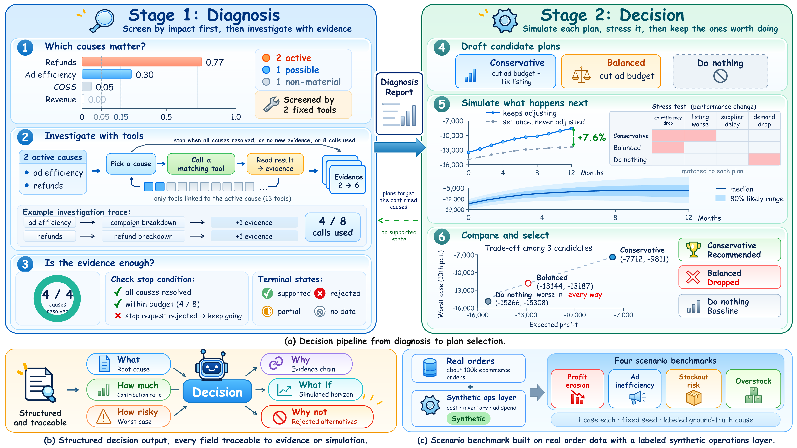
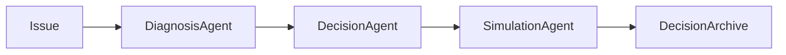

# E-commerce Operations Decision Agent

[English](README.md) | [中文](README_CN.md)

A decision pipeline for shop operations: screen issues by impact, investigate with evidence, simulate candidate plans under stress, then recommend a plan that is structured and traceable.



**(a)** Two-stage pipeline from diagnosis to plan selection.
**(b)** Every decision answers six fields that trace back to evidence or simulation.
**(c)** Four labeled scenarios on public Olist orders plus a synthetic operations layer.

## Highlights

- **Program-gated diagnosis.** Candidate causes are ranked by contribution to the issue. Only causes above fixed thresholds enter investigation. The model does not choose what to look at first.
- **Stop when evidence is enough.** Tool use is budgeted. If the model asks to stop while an active cause is still open, the request is rejected and investigation continues.
- **Simulate, stress, then prune.** Each plan is rolled forward, stressed on shocks that match its actions, then dropped if it is worse on both expected profit and worst-case profit.
- **Structured and traceable output.** A decision must answer *what*, *how much*, *how risky*, *why*, *what if*, and *why not*. Rejected alternatives are part of the record.

## How it works

LLM agents choose the next investigation step and draft plan direction. Profit, inventory, anomaly scores, and world evolution are computed by deterministic services. The simulator (`world-v1`) is a parameterized operations sandbox, not a learned world model.



### Stage 1: Diagnosis

Screen by impact first, then investigate with evidence.

1. **Which causes matter?** Two fixed preflight tools run before any model loop (for profit erosion: `get_issue_context`, `decompose_profit`). Contribution ratios are scored against **0.15** (active) and **0.05** (possible). Everything else is non-material and stays out of the loop.
2. **Investigate with tools.** Thirteen read-only tools are available, but only tools linked to an active cause can be called. The shared budget is **8** calls, including preflight.
3. **Is the evidence enough?** The loop stops when every active cause is resolved, no new evidence appears, or the budget is spent. A stop request with unresolved active causes is rejected. Each cause ends as supported, rejected, partial, or no data. The handoff is a structured diagnosis report, not free text.

### Stage 2: Decision

Simulate each plan, stress it, then keep the ones worth doing.

4. **Draft candidate plans.** Plans target confirmed causes (for example: conservative = cut ad budget and fix listing; balanced = cut ad budget). A do-nothing baseline is always attached.
5. **Simulate what happens next.** Default execution keeps adjusting at checkpoints; `--open-loop` sets the plan once and never adjusts. Stress cases (ad efficiency drop, listing worse, supplier delay, demand drop) are matched to each plan's actions rather than applied as a full grid. Outcomes are reported as a median and an 80% likely range.
6. **Compare and select.** Plans are compared on expected profit versus worst case (10th percentile). A plan that is worse on both axes is dropped. The survivor is recommended against the do-nothing baseline.

## Decision record

| Field | Meaning |
| --- | --- |
| What | Root cause from the diagnosis report |
| How much | Contribution ratio from screening |
| Why | Evidence chain from tool results |
| What if | Simulated horizon versus baseline |
| How risky | Worst case (10th percentile) |
| Why not | Strategies rejected after validation or evaluation |

## Benchmark

Four labeled cases, one each, with a fixed seed and a hidden ground-truth cause:

- Profit erosion
- Ad inefficiency
- Stockout risk
- Overstock (`excess_inventory`)

Orders come from the public Olist dataset. Cost, inventory, and ad spend are filled by a synthetic operations layer so each case has a known cause. Scenario files live in `evals/scenarios/`.

## Repository

```
agents/              diagnosis, decision, simulation, rollout
tools/diagnosis/     13 read-only investigation tools
services/            ingest, profit, anomaly, world simulator, archive
domain/              pydantic models for issues, causes, strategies, reports
evals/scenarios/     four labeled benchmark cases
app/                 FastAPI and CLI
web/                 dashboard (Vite, proxied to the API)
prompts/             system prompts per agent
```

## Quick start

Python 3.11+.

```bash
pip install -e ".[dev]"
```

Create a `.env` in the repo root:

```bash
ECOM_LLM_API_KEY=...
ECOM_LLM_BASE_URL=https://api.deepseek.com
ECOM_LLM_MODEL=deepseek-chat
```

`ECOM_LLM_BASE_URL` and `ECOM_LLM_MODEL` are optional; the values above are the defaults.

End-to-end daily run (ingest + issues only):

```bash
python -m app.cli run-daily
```

Diagnosis → plan → simulate → archive. `--fake-llm` runs without an API key:

```bash
python -m app.cli diagnose --fake-llm
python -m app.cli plan --fake-llm
python -m app.cli simulate --fake-llm
python -m app.cli archive --fake-llm
```

API and dashboard:

```bash
uvicorn app.api.main:app --reload --port 8000
cd web && npm install && npm run dev
```

The UI is at `http://127.0.0.1:5173` and proxies `/api` to port 8000.

```bash
pytest tests
```
