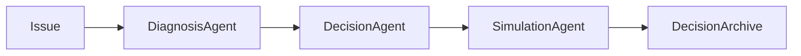

# 电商经营决策 Agent

[English](README.md) | [中文](README_CN.md)

面向店铺经营的决策流水线：先按影响筛问题，再带证据调查，对候选方案做模拟和压测，最后给出结构化、可追溯的推荐。


**(a)** 两阶段流水线：从诊断到方案选择。
**(b)** 每次决策回答六个字段，均可追溯到证据或模拟。
**(c)** 四个标注场景：公开 Olist 订单 + 合成经营层。

## 亮点

- **程序门控诊断。** 候选根因按对问题的贡献排序，只有超过固定阈值的才进入调查。先查什么不由模型自己定。
- **证据够了才停。** 工具调用有预算。若还有未结的 active 根因，模型请求停止会被驳回，调查继续。
- **先模拟、再压测、再剪枝。** 每个方案向前推演，只测与其动作相关的冲击；若期望利润和最差情况都更差，则剔除。
- **结构化、可追溯的产物。** 决策必须回答是什么、多大、多险、为什么、会怎样、为什么不选别的。被否方案同样写入记录。

## 工作方式

LLM Agent 只负责下一步调查和方案方向。利润、库存、异常分数和世界演化由确定性服务计算。模拟器（`world-v1`）是参数化经营沙盘，不是学习出来的世界模型。



### 阶段 1：诊断

先按影响筛，再带证据查。

1. **哪些根因重要？** 模型循环开始前先跑两个固定预筛工具（利润侵蚀场景：`get_issue_context`、`decompose_profit`）。贡献比对照 **0.15**（active）和 **0.05**（possible）。其余视为非实质，不进循环。
2. **用工具调查。** 共 13 个只读工具，但只能调用与 active 根因关联的工具。总预算 **8** 次，含预筛。
3. **证据够了吗？** 所有 active 根因已结案、没有新证据、或预算用尽时停止。仍有未结根因时的停止请求会被驳回。每个根因终态为 supported、rejected、partial 或 no data。阶段之间传递的是结构化诊断报告，不是自由文本。

### 阶段 2：决策

每个方案先模拟、再压测，只留下值得做的。

4. **起草候选方案。** 方案针对已确认根因（例如：保守 = 削减广告预算并修复 listing；均衡 = 削减广告预算）。始终附带「什么都不做」基线。
5. **模拟接下来会发生什么。** 默认在检查点继续调整；`--open-loop` 则一次设定、不再改。压力场景（广告效率下降、listing 变差、供应商延迟、需求下降）按方案动作匹配，不铺满整张网格。结果报告中位数和 80% 可能区间。
6. **比较并选择。** 比较期望利润与最差情况（第 10 百分位）。两轴都更差的方案被剔除。留下的方案相对「什么都不做」给出推荐。

## 决策记录

| 字段 | 含义 |
| --- | --- |
| What | 诊断报告中的根因 |
| How much | 预筛得到的贡献比 |
| Why | 工具结果构成的证据链 |
| What if | 相对基线的模拟区间 |
| How risky | 最差情况（第 10 百分位） |
| Why not | 校验或评估后被否的方案 |

## 评测基准

四类标注案例各 1 个，固定 seed，带隐藏的真实根因：

- 利润侵蚀（Profit erosion）
- 广告低效（Ad inefficiency）
- 缺货风险（Stockout risk）
- 库存积压（Overstock，`excess_inventory`）

订单来自公开 Olist 数据集。成本、库存、广告花费由合成经营层补齐，使每个案例有已知根因。场景文件在 `evals/scenarios/`。

## 仓库结构

```
agents/              诊断、决策、模拟、rollout
tools/diagnosis/     13 个只读调查工具
services/            入库、利润、异常、经营沙盘、归档
domain/              问题、根因、策略、报告的 pydantic 模型
evals/scenarios/     四个标注评测案例
app/                 FastAPI 与 CLI
web/                 看板（Vite，代理到 API）
prompts/             各 Agent 的系统提示
```

## 快速开始

需要 Python 3.11+。

```bash
pip install -e ".[dev]"
```

在仓库根目录创建 `.env`：

```bash
ECOM_LLM_API_KEY=...
ECOM_LLM_BASE_URL=https://api.deepseek.com
ECOM_LLM_MODEL=deepseek-chat
```

`ECOM_LLM_BASE_URL` 和 `ECOM_LLM_MODEL` 可选，上面是默认值。

每日一条龙（只做入库和问题检测）：

```bash
python -m app.cli run-daily
```

诊断 → 规划 → 模拟 → 归档。`--fake-llm` 无需 API key：

```bash
python -m app.cli diagnose --fake-llm
python -m app.cli plan --fake-llm
python -m app.cli simulate --fake-llm
python -m app.cli archive --fake-llm
```

API 与看板：

```bash
uvicorn app.api.main:app --reload --port 8000
cd web && npm install && npm run dev
```

界面在 `http://127.0.0.1:5173`，`/api` 代理到 8000 端口。

```bash
pytest tests
```
